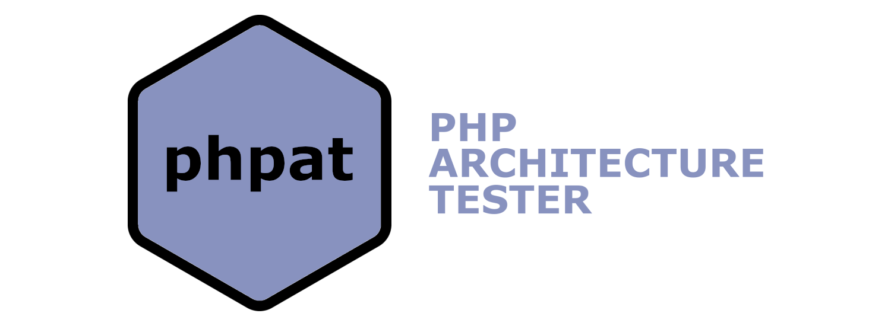

[](LICENSE)
[](https://github.com/carlosas/phparchitest/issues)


PHPArchiTest is an architecture testing tool for PHP.

# Installation
```bash
composer require carlosas/phparchitest
```

# Configuration
You might want to setup a basic configuration:
```yaml
# phpat.yml
files:
  src_path: src/
  autoload_file: vendor/autoload.php
tests:
  path: tests/architecture/
```
This is the complete list of options:
* `files` `src_path`: The root path of your application.
* `files` `autoload_file`: The autoload file of your application.
* `files` `origin_included`: Files you want to be included as origin (empty=all).
* `files` `destinationn_included`: Files you want to be included as destination (empty=all).
* `files` `origin_excluded`: Files you want to be excluded as origin (empty=none).
* `files` `destinationn_excluded`: Files you want to be excluded as destination (empty=none).
* `tests` `path`: The path where your tests are.

# Test definition
This could be a test with a couple of rules:
```php
<?php

use PHPArchiTest\Rule\Dependency;
use PHPArchiTest\Rule\Inheritance;
use PHPArchiTest\Rule\Rule;
use PHPArchiTest\Test\ArchiTest;

class ExampleTest extends ArchiTest
{
    public function testDomainDoNotDependOnApplication(): Rule
    {
        return $this->newRule
            ->class('Domain/*')
            ->shouldNotHave(new Dependency())
            ->withClass('Application/*')
            ->build();
    }
    
    public function testAllHandlersExtendAbstractCommandHandler(): Rule
    {
        return $this->newRule
            ->class('Application/*/UseCase/*Handler.php')
            ->shouldHave(new Inheritance())
            ->withClass('Application/Shared/UseCase/AbstractCommandHandler.php')
            ->build();
    }
}
```
