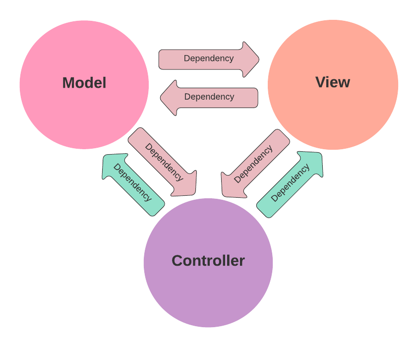
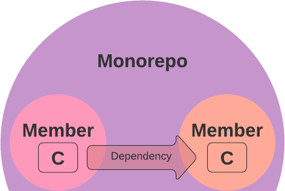
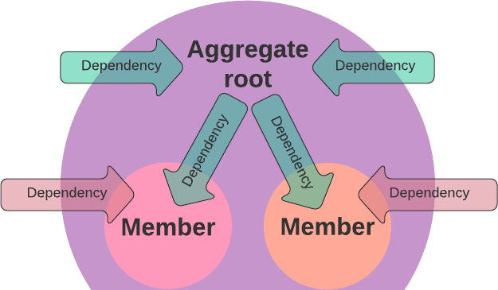
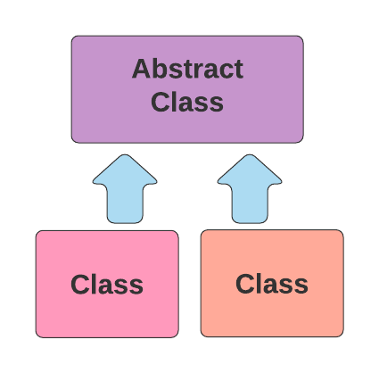
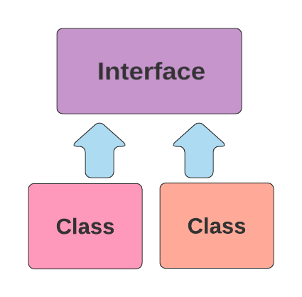
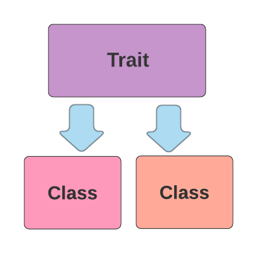

# What to test

The following sections illustrate some typical checks you could perform.

## Class dependencies

#### Layered Architecture

    

If you are organizing your code in layers (e.g. with an onion structure), you might want to ensure that
the inner layers do not depend on the outer ones:

>Classes with name App\\Domain\\* must not depend on classes with name App\\Application\\* and classes with name App\\Infrastructure\\*

>Classes with name App\\Application\\* must not depend on classes with name App\\Infrastructure\\*

<h2></h2>

#### Model-View-Controller

    

If you are using a MVC approach, you could ensure that both model and view are not coupled to controllers. You also might want to check that they are not coupled to each other:

>Classes with name App\\Model\\* and classes with name App\\View\\* must not depend on classes with name App\\Controller\\*

>Classes with name App\\Model\\* must not depend on classes with name App\\View\\*

>Classes with name App\\View\\* must not depend on classes with name App\\Model\\*

In other words:

>Classes with name App\\Model\\* can only depend on classes with name App\\Model\\*

>Classes with name App\\View\\* can only depend on classes with name App\\View\\*

<h2></h2>

#### Monorepos

    

If you are using different composer files to split your code in members of a monorepo, you might want to ensure that
the code from one member does not depend on the code from another member

>Classes autoloadable from composer (a/composer.json) must not depend on classes autoloadable from composer (b/composer.json)

You also might want to ensure that the code from one member does not depend on composer dependencies declared in another member
(excluding the ones that are declared on their own)

>Classes autoloadable from composer (a/composer.json) must not depend on classes that are dependencies from composer (b/composer.json)
>excluding classes that are dependencies from composer (a/composer.json)

<h2></h2>

#### Aggregates

    

You won't want your classes to have direct access to the members of an aggregate, except for the aggregate root.
You can use a lot of different approaches to identify the root and its members: by namespace, filepath, an abstract or interface for the aggregate root, etc.
If you have, for instance, an AggregateRootInterface you can create a rule like this

>Classes with name App\\* excluding classes that implement App\\Domain\\Entity\\AggregateRootInterface must not depend on
>classes with name App\\Domain\\Entity\\* excluding classes that implement App\\Domain\\Entity\\AggregateRootInterface

 

## Inheritance

#### Enforcing or forbidding an abstract extension

    

You might want to ensure that a specific type of classes are extending a certain abstract class. Services, Controllers, CommandHandlers, etc.

>Classes with name App\\Application\\\*Handler must extend class with name App\\Application\\AbstractHandler

<h2></h2>

 

## Composition

#### Enforcing or forbidding an interface implementation

    

You might want to ensure that a specific type of classes are implementing a certain interface. ValueObjects, Entities, etc.

>Classes with name App\\Domain\\Entity\\\* must implement class with name App\\Domain\\Entity\\EntityInterface

<h2></h2>

## Mixing

#### Enforcing or forbidding a trait inclusion

    

You might want to ensure that a specific type of classes are including a certain trait

>Classes with name App\\Infrastructure\\Repository\\\* must include class with name App\\Infrastructure\\Repository\\RepositoryTrait

<h2></h2>
