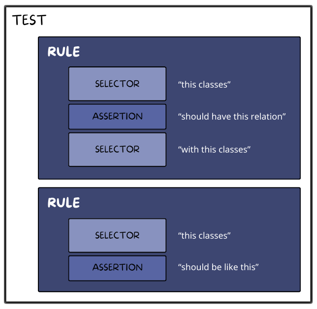

# Rules

A rule is a statement, consisting in Selectors and Assertions, that must be true for the test to pass.

Each test class can contain one or more rules.



Your rules must be public methods that start with `test_` or apply the `#[TestRule]` attribute. You can build rules using the `\PHPat\Test\PHPat::rule()` method:

```php
namespace App\Tests\Architecture;

use PHPat\Selector\Selector;
use PHPat\Test\Attributes\TestRule;
use PHPat\Test\Builder\Rule;
use PHPat\Test\PHPat;

final class ConfigurationTest
{
    public function test_domain_independence(): Rule
    {
        return PHPat::rule()
            ->classes(Selector::inNamespace('App\Domain'))
            ->canOnlyDependOn()
            ->classes(Selector::inNamespace('App\Domain'));
        ;
    }

    #[TestRule]
    public function entities_are_final(): Rule
    {
        return PHPat::rule()
            ->classes(Selector::extends(Entity::class))
            ->shouldBeFinal()
        ;
    }
}
```

## Reusing rules

You might want to reuse rules in different tests or parametrize them for a modular scenario.

**Reusing rules is possible by extending a class or using traits.**

Let's see an example:

You are splitting bounded contexts, and you want the domain of each context to be independent from the others.
Your rule should check that classes in the domain of a context do not depend on classes in the domain of another context.

This is what you can do:
```php
namespace App\Tests\Architecture;

abstract class AbstractDomainTest
{
    public final function test_bounded_context_domain_independence(): Rule
    {
        return PHPat::rule()
            ->classes(
                Selector::inNamespace(sprintf('App\Module\%s\Domain', $this->getModuleName()))
            )
            ->canOnlyDependOn()
            ->classes(
                Selector::inNamespace(sprintf('App\Module\%s\Domain', $this->getModuleName())),
                Selector::inNamespace('App\Module\Shared\Domain'),
            )
            ->because('Domain should not use code from other contexts');
    }

    abstract protected function getModuleName(): string
}
```
    
```php
namespace App\Tests\Architecture\User;

final class UserDomainTest extends AbstractDomainTest
{
    protected function getModuleName(): string
    {
        return 'User';
    }
}
```

Note that you would only need to register the `UserDomainTest` class as a PHPat test in the PHPStan config file.

## Dynamic Rule Sets
It is possible to dynamically create rules by returning an iterable of Rules from your method:
    
```php
namespace App\Tests\Architecture;

use PHPat\Selector\Selector;
use PHPat\Test\Builder\Rule;
use PHPat\Test\PHPat;

final class ConfigurationTest
{
    private const DOMAINS = [
        'App\Domain1',
        'App\Domain2',
    ];

    /**
     * @return iterable<string, Rule>
     */
    public function test_domain_independence(): iterable
    {
        foreach(self::DOMAINS as $domain) {
            yield $domain => PHPat::rule()
                ->classes(Selector::inNamespace($domain))
                ->canOnlyDependOn()
                ->classes(Selector::inNamespace($domain));
        }
    }
}
```
