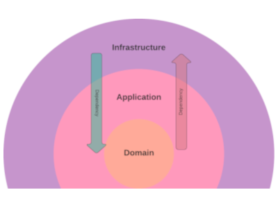
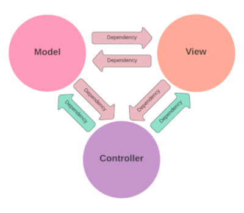
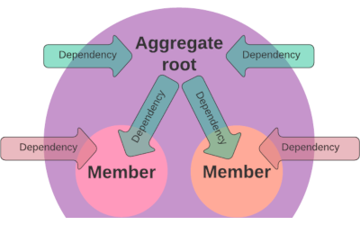
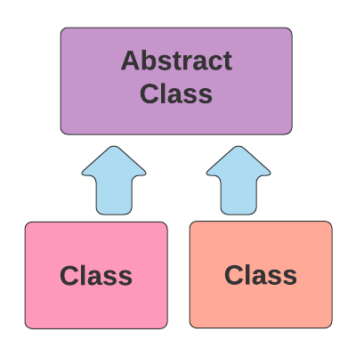
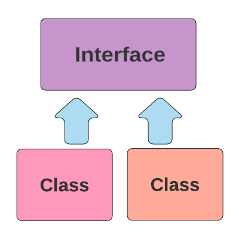

# Examples

The following sections illustrate some typical checks you could perform.

## Class dependencies

#### Layered Architecture

If you are organizing your code in layers (e.g. with an onion structure), you might want to ensure that
the inner layers do not depend on the outer ones:

>Classes in namespace App\Domain should not depend on classes in namespace App\Application and classes in namespace App\Infrastructure

>Classes in namespace App\Application should not depend on classes in namespace App\Infrastructure

<h2></h2>

#### Model-View-Controller

If you are using a MVC approach, you could ensure that both model and view are not coupled to controllers. You also might want to check that they are not coupled to each other:

>Classes in namespace App\Model and classes in namespace App\View should not depend on classes in namespace App\Controller

>Classes in namespace App\Model should not depend on classes in namespace App\View

>Classes in namespace App\View should not depend on classes in namespace App\Model

#### Vendors coupling

>Classes in namespace App\Domain can only depend on classes in namespace App\Domain

<h2></h2>

#### Aggregates

You won't want your classes to have direct access to the members of an aggregate, except for the aggregate root.
You can use a lot of different approaches to identify the root and its members: by namespace, filepath, an abstract or interface for the aggregate root, etc.
If you have, for instance, an AggregateRootInterface you can create a rule like this

>Classes in namespace App excluding classes that implement App\Domain\Entity\AggregateRootInterface should not depend on
>classes in namespace App\Domain\Entity excluding classes that implement App\Domain\Entity\AggregateRootInterface

 

## Inheritance

#### Enforcing or forbidding an abstract extension

You might want to ensure that a specific type of classes are extending a certain abstract class. Services, Controllers, CommandHandlers, etc.

>Classes with name `/^App\\Application\\.+Handler$/` should extend class with name App\Application\AbstractHandler

<h2></h2>

 

## Composition

#### Enforcing or forbidding an interface implementation

You might want to ensure that a specific type of classes are implementing a certain interface. ValueObjects, Entities, etc.

>Classes in namespace App\Domain\Entity should implement class with name App\Domain\Entity\EntityInterface

<h2></h2>
