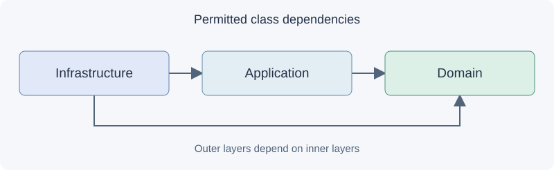
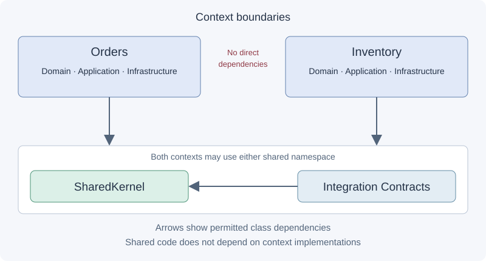
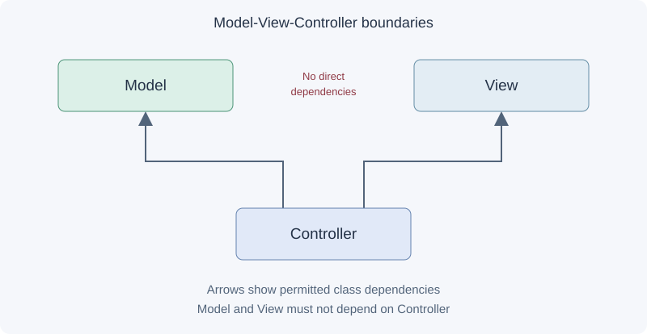
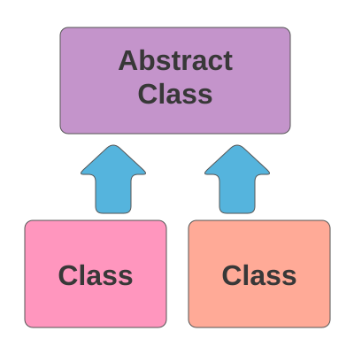
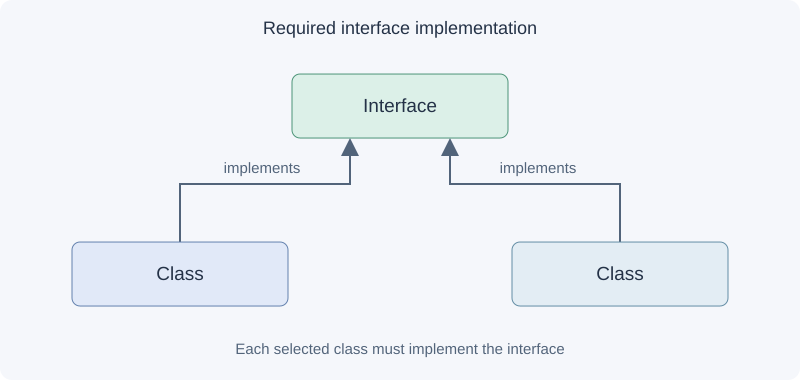

# Examples

The following examples show how to turn architectural decisions into PHPat rules. Choose the rules that fit your application and adapt the namespaces to your project; these examples are independent, not a single configuration to apply together.

Each PHP test class must be autoloadable, registered with the `phpat.test` tag, and included in PHPStan's analysed paths. See [Getting started](getting-started.md#configuration) for the configuration.

## Layered architecture

Suppose your application has three layers: `App\Domain`, `App\Application`, and `App\Infrastructure`. To protect the inner layers, Domain must not depend on Application or Infrastructure, and Application must not depend on Infrastructure.



Arrows show permitted class dependencies, not execution order. Infrastructure can implement interfaces defined in an inner layer, allowing that layer to use an abstraction without depending on its infrastructure implementation.

```php
<?php

namespace Tests\Architecture;

use PHPat\Selector\Selector;
use PHPat\Test\Builder\Rule;
use PHPat\Test\PHPat;

final class LayeredArchitectureTest
{
    public function test_domain_does_not_depend_on_outer_layers(): Rule
    {
        return PHPat::rule()
            ->classes(Selector::inNamespace('App\Domain'))
            ->shouldNot()
            ->dependOn()
            ->classes(
                Selector::inNamespace('App\Application'),
                Selector::inNamespace('App\Infrastructure')
            );
    }

    public function test_application_does_not_depend_on_infrastructure(): Rule
    {
        return PHPat::rule()
            ->classes(Selector::inNamespace('App\Application'))
            ->shouldNot()
            ->dependOn()
            ->classes(Selector::inNamespace('App\Infrastructure'));
    }
}
```

These rules protect the named layer boundaries. To also restrict dependencies on third-party code, see [Vendor coupling](#vendor-coupling).

## Bounded contexts

You can organize an application into contexts such as Orders and Inventory, with layers inside each context:

```text
App\
├── Orders\
│   ├── Domain\
│   ├── Application\
│   └── Infrastructure\
├── Inventory\
│   ├── Domain\
│   ├── Application\
│   └── Infrastructure\
├── SharedKernel\
└── Integration\Contracts\
```

In this example, a context must not depend directly on another context. Both can use a shared kernel of common domain types and shared integration contracts. The shared kernel and integration contracts have separate namespaces so that sharing domain types does not require sharing application implementations.



The following test generates three rules per context: one for context isolation and two for its layer boundaries. Returning `iterable<Rule>` lets you reuse these checks for every context in the list; see [Dynamic Rule Sets](documentation/rules.md#dynamic-rule-sets).

```php
<?php

namespace Tests\Architecture;

use PHPat\Selector\Selector;
use PHPat\Test\Builder\Rule;
use PHPat\Test\PHPat;

final class BoundedContextsTest
{
    private const CONTEXTS = ['App\Orders', 'App\Inventory'];

    /**
     * @return iterable<Rule>
     */
    public function test_context_boundaries(): iterable
    {
        foreach (self::CONTEXTS as $context) {
            yield PHPat::rule()
                ->classes(Selector::inNamespace($context))
                ->shouldNot()
                ->dependOn()
                ->classes(Selector::inNamespace('App'))
                ->excluding(
                    Selector::inNamespace($context),
                    Selector::inNamespace('App\SharedKernel'),
                    Selector::inNamespace('App\Integration\Contracts')
                );

            yield PHPat::rule()
                ->classes(Selector::inNamespace($context.'\Domain'))
                ->shouldNot()
                ->dependOn()
                ->classes(
                    Selector::inNamespace($context.'\Application'),
                    Selector::inNamespace($context.'\Infrastructure')
                );

            yield PHPat::rule()
                ->classes(Selector::inNamespace($context.'\Application'))
                ->shouldNot()
                ->dependOn()
                ->classes(Selector::inNamespace($context.'\Infrastructure'));
        }
    }
}
```

For example, `App\Orders\Application\PlaceOrder` may depend on `App\Orders\Domain\Order` but not on `App\Inventory\Application\ReserveStock`. Dependencies outside `App` are not restricted by this test. Add every context to `CONTEXTS` so that its outgoing dependencies and layers are checked.

### Shared kernel and integration contracts

Shared code must not become a route back into a context's implementation. Here, SharedKernel can depend only on itself and PHP built-in classes. Integration contracts can additionally use SharedKernel types, but cannot depend on Orders or Inventory.

```php
<?php

namespace Tests\Architecture;

use PHPat\Selector\Selector;
use PHPat\Test\Builder\Rule;
use PHPat\Test\PHPat;

final class SharedCodeTest
{
    public function test_shared_kernel_is_independent(): Rule
    {
        return PHPat::rule()
            ->classes(Selector::inNamespace('App\SharedKernel'))
            ->canOnly()
            ->dependOn()
            ->classes(
                Selector::inNamespace('App\SharedKernel'),
                Selector::isStandardClass()
            );
    }

    public function test_integration_contracts_are_independent(): Rule
    {
        return PHPat::rule()
            ->classes(Selector::inNamespace('App\Integration\Contracts'))
            ->canOnly()
            ->dependOn()
            ->classes(
                Selector::inNamespace('App\Integration\Contracts'),
                Selector::inNamespace('App\SharedKernel'),
                Selector::isStandardClass()
            );
    }
}
```

For example, Orders can publish an `OrderPlaced` event through an `EventPublisher` interface, both defined in `App\Integration\Contracts`. Inventory can consume that event without referring to an Orders class:

```php
<?php

namespace App\Integration\Contracts;

final class OrderPlaced
{
    public function __construct(
        public readonly string $orderId,
        public readonly string $productId,
        public readonly int $quantity
    ) {
    }
}

interface EventPublisher
{
    public function publish(OrderPlaced $event): void;
}

namespace App\Orders\Application;

use App\Integration\Contracts\EventPublisher;
use App\Integration\Contracts\OrderPlaced;

final class PlaceOrder
{
    public function __construct(private EventPublisher $publisher)
    {
    }

    public function place(string $orderId, string $productId, int $quantity): void
    {
        // Place the order, then publish the integration event.
        $this->publisher->publish(new OrderPlaced($orderId, $productId, $quantity));
    }
}

namespace App\Inventory\Application;

use App\Integration\Contracts\OrderPlaced;

final class WhenOrderPlaced
{
    public function __invoke(OrderPlaced $event): void
    {
        // Reserve stock using this context's own domain objects.
    }
}
```

`BoundedContextsTest` rejects direct dependencies between the contexts, while `SharedCodeTest` prevents the event and publisher interface from referencing their implementations. A concrete publisher and handler registration belong in your infrastructure setup. These rules check class dependencies; they do not verify event delivery or business behaviour.

## Vendor coupling

If your domain should be independent of frameworks and vendor libraries, use an allowlist. This example permits only classes in `App\Domain` and PHP built-in classes such as `DateTimeImmutable` and `Exception`:

```php
<?php

namespace Tests\Architecture;

use PHPat\Selector\Selector;
use PHPat\Test\Builder\Rule;
use PHPat\Test\PHPat;

final class DomainDependenciesTest
{
    public function test_domain_dependencies_are_explicit(): Rule
    {
        return PHPat::rule()
            ->classes(Selector::inNamespace('App\Domain'))
            ->canOnly()
            ->dependOn()
            ->classes(
                Selector::inNamespace('App\Domain'),
                Selector::isStandardClass()
            );
    }
}
```

Add a specific class or namespace to the targets if you intentionally allow a library. For a bounded context, replace `App\Domain` with its domain namespace and explicitly allow any shared types it needs.

## Model-View-Controller



In this example, Model and View must not depend on Controller. We also choose to keep Model and View independent of each other; adapt that policy if your MVC design allows views to use models.

```php
<?php

namespace Tests\Architecture;

use PHPat\Selector\Selector;
use PHPat\Test\Builder\Rule;
use PHPat\Test\PHPat;

final class MvcTest
{
    public function test_model_and_view_do_not_depend_on_controllers(): Rule
    {
        return PHPat::rule()
            ->classes(
                Selector::inNamespace('App\Model'),
                Selector::inNamespace('App\View')
            )
            ->shouldNot()
            ->dependOn()
            ->classes(Selector::inNamespace('App\Controller'));
    }

    public function test_model_does_not_depend_on_view(): Rule
    {
        return PHPat::rule()
            ->classes(Selector::inNamespace('App\Model'))
            ->shouldNot()
            ->dependOn()
            ->classes(Selector::inNamespace('App\View'));
    }

    public function test_view_does_not_depend_on_model(): Rule
    {
        return PHPat::rule()
            ->classes(Selector::inNamespace('App\View'))
            ->shouldNot()
            ->dependOn()
            ->classes(Selector::inNamespace('App\Model'));
    }
}
```

## Aggregates

Suppose `App\Domain\Order\Order` is an aggregate root and `App\Domain\Order\OrderLine` is an internal member. Classes outside `App\Domain\Order` should interact with the root rather than accessing its members directly. Classes inside the aggregate can still depend on each other.

```text
App\Application\PlaceOrder → App\Domain\Order\Order       allowed
App\Application\PlaceOrder → App\Domain\Order\OrderLine   forbidden
App\Domain\Order\Order     → App\Domain\Order\OrderLine   allowed
```

```php
<?php

namespace Tests\Architecture;

use App\Domain\Order\Order;
use PHPat\Selector\Selector;
use PHPat\Test\Builder\Rule;
use PHPat\Test\PHPat;

final class OrderAggregateTest
{
    public function test_order_internals_are_accessed_through_the_root(): Rule
    {
        return PHPat::rule()
            ->classes(Selector::inNamespace('App'))
            ->excluding(Selector::inNamespace('App\Domain\Order'))
            ->shouldNot()
            ->dependOn()
            ->classes(Selector::inNamespace('App\Domain\Order'))
            ->excluding(Selector::classname(Order::class));
    }
}
```

Keep only the root and its internal members in this namespace: this rule treats every class except `Order` as internal. Repeat the rule with a separate namespace and root for each aggregate you want to protect.

## Inheritance



If your application requires handlers to extend `App\Application\AbstractHandler`, select classes whose fully qualified name starts with `App\Application\` and ends with `Handler`. Exclude the base class itself.

```php
<?php

namespace Tests\Architecture;

use App\Application\AbstractHandler;
use PHPat\Selector\Selector;
use PHPat\Test\Builder\Rule;
use PHPat\Test\PHPat;

final class HandlerInheritanceTest
{
    public function test_handlers_extend_the_base_class(): Rule
    {
        return PHPat::rule()
            ->classes(Selector::classname('/^App\\\\Application\\\\.+Handler$/', true))
            ->excluding(Selector::classname(AbstractHandler::class))
            ->should()
            ->extend()
            ->classes(Selector::classname(AbstractHandler::class));
    }
}
```

Use `shouldNot()->extend()` with the same targets if you instead want to forbid that inheritance.

## Interface implementation



To require entities in `App\Domain\Entity` to implement `EntityInterface`, select the namespace and exclude interface declarations:

```php
<?php

namespace Tests\Architecture;

use App\Domain\Entity\EntityInterface;
use PHPat\Selector\Selector;
use PHPat\Test\Builder\Rule;
use PHPat\Test\PHPat;

final class EntityInterfaceTest
{
    public function test_entities_implement_the_contract(): Rule
    {
        return PHPat::rule()
            ->classes(Selector::inNamespace('App\Domain\Entity'))
            ->excluding(Selector::isInterface())
            ->should()
            ->implement()
            ->classes(Selector::classname(EntityInterface::class));
    }
}
```

This example assumes the namespace contains entity classes and their interfaces. Use `shouldNot()->implement()` to forbid a particular interface instead.
