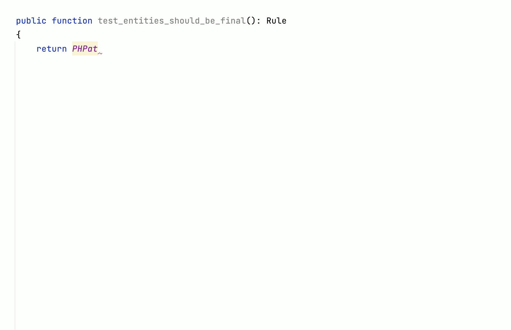

    

<h2 align="center">Easy to use architecture testing tool for PHP</h2>

**PHP Architecture Tester** is a PHPStan extension (Static Analysis tool) designed to verify architectural requirements. It provides a natural language abstraction that enables you to define your own architectural rules and assess their compliance.

    

💡 Check out the [Examples](examples.md) section to get some ideas and see some typical use cases.

🔗 GitHub: https://github.com/carlosas/phpat/
